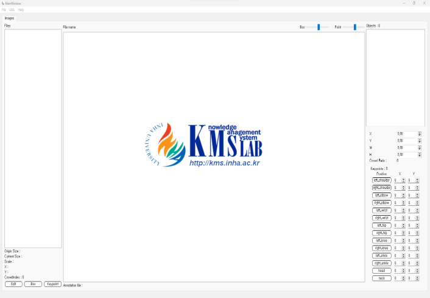

# HuPo-Ant

[Paper](https://www.dbpia.co.kr/journal/articleDetail?nodeId=NODE12014926) | [Github](https://github.com/InhaKMS/HuPo-AnT)

수많은 사람들이 등장하는 이미지에서 어떻게 객체탐지를 수행해야할까요? 이 문제는 객체 탐지 분야의 넘어야 할 산 중 하나입니다. 일반적으로 군중 상황은 해상도에 비해 객체의 크기가 작고 그 수가 많습니다. 더욱 곤란한 점은 사람이 다른 사람이나 장애물에 의해 가려져있다는 것입니다. 만일 포즈 추정까지 수행해야 한다면, 이 문제는 심각해집니다. 그래서 데이터셋의 퀄리티와 세심한 라벨링에 많은 의존을 하게 됩니다. 

Human Object Detection과 Pose Estimation에 사용되는 데이터셋은 참 만들기가 번거롭습니다. 사진 속 객체의 Bounding Box 좌표와 관절 좌표가 필요한데,  보통 사진에 등장하는 사람 한 명당 15~20개 정도의 좌표를 사용합니다. 저희는 군중 상황에서의 탐지를 주로 연구했기때문에, 단순히 기존 데이터셋을 분석하는것만 해도 상당한 시간을 소요해야 했습니다. 

저희는 MS-COCO, CrowdPose 와 같은 훌륭한 연구의 도움을 크게 받았습니다. 특히 CrowdPose는 Crowd Index라는 지표를 사용하여 군중의 Occlusion 정도를 수치화하였습니다. 수많은 이미지 중 군중 상황에 부합하는 이미지가 무엇인지 필터링할 필요가 있었는데, 그때 Crowd Index의 도움을 많이 받았습니다. 

Crowd Pose는 Crowd Index를 기반으로 이미지를 세가지로 분류하였습니다. 수치가 높은 데이터, 낮은 데이터, 중간 데이터로 나누었으며 데이터셋의 Crowd Index 분포도 일정하게 하였습니다. 즉 CrwodPose 데이터셋을 사용하여 모델을 학습시키면, 다양한 Occlusion에 강건한 Pose Estimation 모델을 만들 수 있었습니다. 

### Crowd Index

Crowd Index는 두 객체가 겹쳐있을 때, 키포인트가 얼마나 다른 객체의 바운딩박스에 포함되는지에 대한 비율을 기반으로 계산되었습니다. 수식은 논문에 공개되어있었지만, 실제 수치가 계산되는 코드는 구할 수 없었습니다. 그 수치를 직접 계산하며 Crowd Index를 계산하는 코드를 다시 구현할 수 있었는데, 이 과정이 참 힘들었던 기억이 납니다.

중요한 점은, Crowd Index가 높다 해서 만드시 군중 이미지인 것은 아니었다는 점입니다. 객체의 겹침 정도로 계산되는 수치이기 때문에, 이미지에 얼마나 많은 사람이 등장하는지는 알 수 없었습니다. 저희의 관심사는 군중 이미지였기때문에, 사람 수를 고려한 새로운 데이터셋을 구축하기로 했습니다. 

### HuPoAnt

기존에 있던 라벨을 수정하는 것은 쉽지 않은 작업입니다. 차라리 새로 만드는게 편할 수도 있습니다. 마치 남의 코드를 수정하는 것보다 처음부터 만드는게 편한 것과 비슷한 느낌입니다. 그래서 기존의 주석을 수정하는 것에 최적화된 라벨링 도구를 제작하였습니다. 

프로그램의 기능과 사용법에 대한 자세한 내용은 논문에서 설명하고 있으니 참고하시면 좋을 것 같습니다. 
### 추후 연구

필요한 개선 사항이 남아있습니다. 어떤 데이터셋은 COCO의 형식을 따르지 않습니다. 심지어는 JSON 파일이 아닌 경우도 있죠. 일례로 Crowd Human 데이터셋은 OGDT라는 독자적인 파일 포맷을 사용합니다. 다양한 형식이 호환되고 자동 변환까지 가능한 도구라면 더욱 유용할것입니다. 비디오 데이터를 처리하는 기능도 끝내 추가되지 못한 것이 아쉽습니다. 
프로그램의 최적화 부분에서도 미흡한 부분이 있습니다. 데이터 처리 효율을 생각해서 C++로 개발하려고 했었지만 개발 기간이 넉넉하지 않아 Python으로 개발했습니다. 그래도 긴고의 노력 끝에 수 만 건의 이미지 데이터 정도는 감당할 수 있는 수준이 되었습니다. 
마지막으로, 아무것도 모르는 저를 여기까지 이끌어 주신 교수님, 함께 개발하면서 저의 부족한 점을 보완해주신 연구실 동료들에게 감사의 말씀을 전합니다. 
